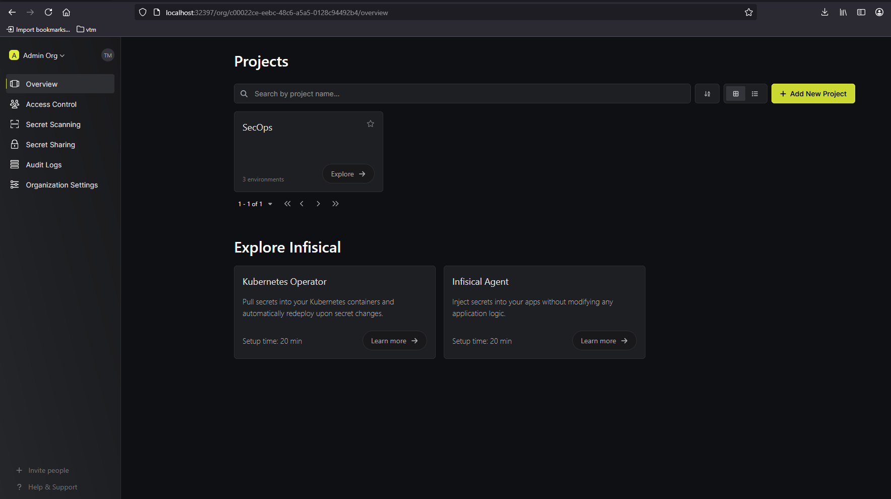
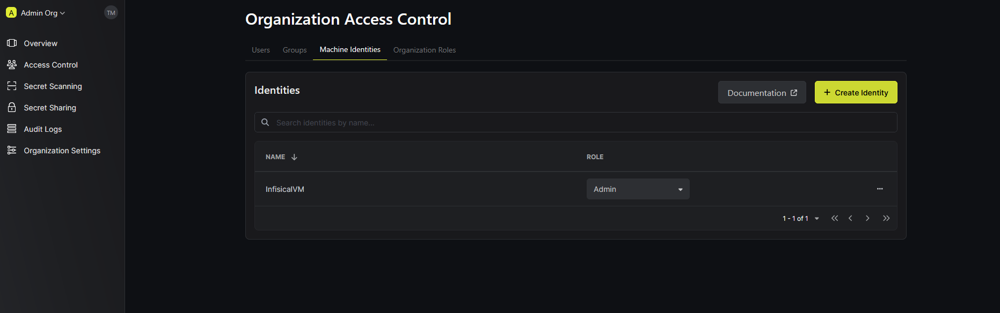
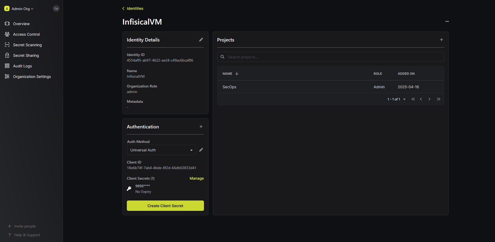

<a name="top"></a>

# E5-DVSCOPC  
**Rendu de MOAD Djamel**  

<p align="center">
  <h3 align="center">Projet E5-DVSCOPC : Stripe + Infisical</h3>
</p>

---

## 🔍 À propos du projet

Ce projet consiste à déployer une application Django utilisant Stripe, sécurisée par **Infisical**, dans un cluster Kubernetes (via Minikube). Il comprend également la configuration de l'opérateur Infisical, le déploiement de secrets.

---

## 📦 Manifests YAML

### 1. `simple-values-example.yaml`

```yaml
apiVersion: v1
kind: Secret
metadata:
  name: infisical-secrets
type: Opaque
stringData:
  AUTH_SECRET: cOBsi8Dv24Q7MltCGVHBoRCoQOn9MfoZFNoCqOwyCpw=
  ENCRYPTION_KEY: a347bee3c7881c249bce748c497dd9d6
  SITE_URL: http://192.168.49.2
  HTTPS_ENABLED: "false"
  TELEMETRY_ENABLED: "false"
```

### 2. `values.yaml`

```yaml
infisical:
  image:
    repository: infisical/infisical
    tag: "v0.97.0-postgres"
    pullPolicy: IfNotPresent
ingress:
  nginx:
    enabled: true
```

### 3. `infisical-secret-crd.yaml`

```yaml
apiVersion: secrets.infisical.com/v1alpha1
kind: InfisicalSecret
metadata:
  name: infisical-secret-crd
  labels:
    label-to-be-passed-to-managed-secret: sample-value
  annotations:
    example.com/annotation-to-be-passed-to-managed-secret: "sample-value"
spec:
  hostAPI: http://192.168.49.2:31596/api
  resyncInterval: 10
  authentication:
    universalAuth:
      secretsScope:
        projectSlug: project-infisical-llt1
        envSlug: dev
        secretsPath: "/"
      credentialsRef:
        secretName: infisicalsecret-universalauth-crd
        secretNamespace: default
  managedSecretReference:
    secretName: managed-secret
    secretNamespace: default
    creationPolicy: "Orphan"
    template:
      includeAllSecrets: true
      data:
        NEW_KEY_NAME: "{{ .KEY.SecretPath }} {{ .KEY.Value }}"
        KEY_WITH_BINARY_VALUE: "{{ .KEY.SecretPath }} {{ .KEY.Value }}"
```

### 4. `infisicalsecret-universalauth-crd.yaml`

```yaml
apiVersion: v1
kind: Secret
metadata:
  name: infisicalsecret-universalauth-crd
type: Opaque
data:
  clientId: MWIzYzhhMDgtMjJjMC00NjU5LWEzY2UtNGQ0M2JkMzM1MjQxCg==
  clientSecret: OTE5OTFkZTlmZTQxODgyOTI3Zjc0ZmViMTlkMjhlNGYyZDczOGViMjg1OWYxNjRkM2E5MzYzNzAxODJlNjVlYwo=
```

### 5. `stripe-app.yaml`

```yaml
apiVersion: v1
kind: ConfigMap
metadata:
  name: rocket-configmap
data:
  DEMO_MODE: "True"
  DEBUG: "True"
---
apiVersion: apps/v1
kind: Deployment
metadata:
  name: rocket-deployment
  labels:
    app: django
    env: preprod
    tier: frontend
spec:
  replicas: 1
  selector:
    matchLabels:
      app: django
  template:
    metadata:
      labels:
        app: django
        env: preprod
        tier: frontend
      annotations:
        infisical.com/enable: "true"
        infisical.com/projectId: "bc385a41-05ac-42f0-b9a9-de4c79332314"
        infisical.com/environment: "dev"
        infisical.com/secretType: "shared"
        infisical.com/token: "st.***"
    spec:
      containers:
      - name: rocket-random
        image: toniocs/rocket-app:prod
        imagePullPolicy: IfNotPresent
        ports:
          - containerPort: 5005
        envFrom:
        - configMapRef:
            name: rocket-configmap
        env:
          - name: STRIPE_PUBLISHABLE_KEY
            value: ""
          - name: STRIPE_SECRET_KEY
            value: ""
        resources:
          requests:
            memory: "64Mi"
            cpu: "250m"
          limits:
            memory: "120Mi"
            cpu: "300m"
---
apiVersion: v1
kind: Service
metadata:
  name: rocket-service
spec:
  type: LoadBalancer
  selector:
    app: django
  ports:
  - port: 5005
    targetPort: 5005
    name: django-np
---
apiVersion: networking.k8s.io/v1
kind: Ingress
metadata:
  name: ingress-rocketapp
spec:
  defaultBackend:
    service:
      name: rocket-service
      port:
        number: 7777
---
apiVersion: autoscaling/v2
kind: HorizontalPodAutoscaler
metadata:
  name: rocket-hpa
spec:
  scaleTargetRef:
    apiVersion: apps/v1
    kind: Deployment
    name: rocket-deployment
  minReplicas: 1
  maxReplicas: 5
  metrics:
  - type: Resource
    resource:
      name: cpu
      target:
        type: Utilization
        averageUtilization: 50
```

---

## 🚀 Déploiement étape par étape

### 1. Installation de Helm

```bash
curl -fsSL -o get_helm.sh https://raw.githubusercontent.com/helm/helm/main/scripts/get-helm-3 && chmod 700 get_helm.sh && ./get_helm.sh
```

### 2. Démarrage du cluster Minikube

```bash
minikube start --listen-address=0.0.0.0 --memory=max --cpus=max --kubernetes-version=v1.31.0
```

### 3. Déploiement d'Infisical

```bash
helm repo add infisical-helm-charts 'https://dl.cloudsmith.io/public/infisical/helm-charts/helm/charts/'
helm repo update
kubectl apply -f simple-values-example.yaml
helm upgrade --install infisical infisical-helm-charts/infisical-standalone --values values.yaml
```

➡️ Accédez à l'interface web d’Infisical en réalisant un **port-forwarding** depuis l'IP Minikube.

##  Aperçu Infisical



## Création d'une Machine Identity



## Ajout du projet à la machine



### 4. Déploiement de l'opérateur Infisical

### 4. Déploiement de l'opérateur Infisical

```bash
helm install --generate-name infisical-helm-charts/secrets-operator
```

### 5. Authentification Universelle

```bash
curl --location --request POST 'http://192.168.49.2:PORTSRVInfisical/api/v1/auth/universal-auth/login' --header 'Content-Type: application/x-www-form-urlencoded' --data-urlencode 'clientId=...' --data-urlencode 'clientSecret=...'
```

### 6. Création et application des secrets

```bash
kubectl apply -f infisicalsecret-universalauth-crd.yaml
kubectl apply -f infisical-secret-crd.yaml
```

### 7. Déploiement de l’application Rocket

```bash
kubectl apply -f stripe-app.yaml
```

---

##  Aperçu Infisical


---

<p align="center">
  <a href="#top">⬆️ Back to top</a>
</p>
